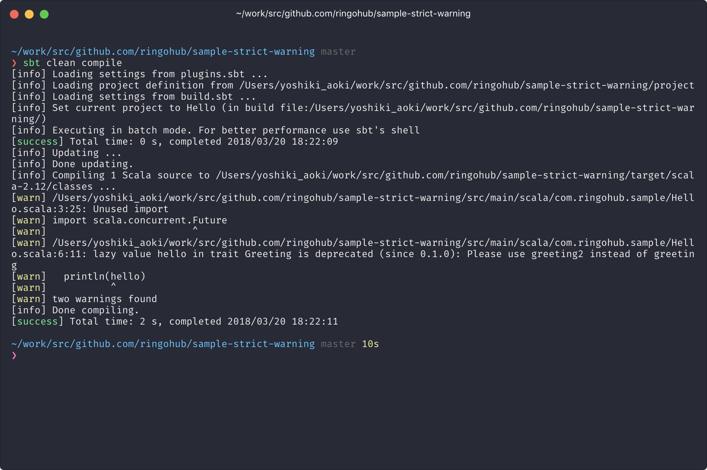

# sample-strict-warning

Add `scalaCompileOptions` to your project like a below.

```scala
import com.ringohub.sbt.StrictWarningPlugin.scalaCompileOptions

lazy val root = (project in file(".")).
  settings(
    inThisBuild(List(
      organization := "com.ringohub",
      version      := "0.1.0-SNAPSHOT",
      scalacOptions := scalaCompileOptions
    )),
    name := "Hello"
  )

```

## CI mode
```bash
sbt -Dignore-deprecation=true clean compile
```

Rise compile error when warnings excluding deprecation.


## Non CI mode
```bash
sbt clean compile
```

Warn including deprecation.


## Development

```bash
~/work/src/github.com/ringohub
❯ sbt new sbt/scala-seed.g8
[info] Set current project to ringohub (in build file:/Users/yoshiki_aoki/work/src/github.com/ringohub/)

A minimal Scala project.

name [Scala Seed Project]: sample-strict-warning

Template applied in ./sample-strict-warning
```

- [sbt Reference Manual — Hello, World](https://www.scala-sbt.org/1.0/docs/ja/Hello.html)
- [lightbend-icon](https://www.scala-sbt.org/1.0/docs/ja/Hello.html)

